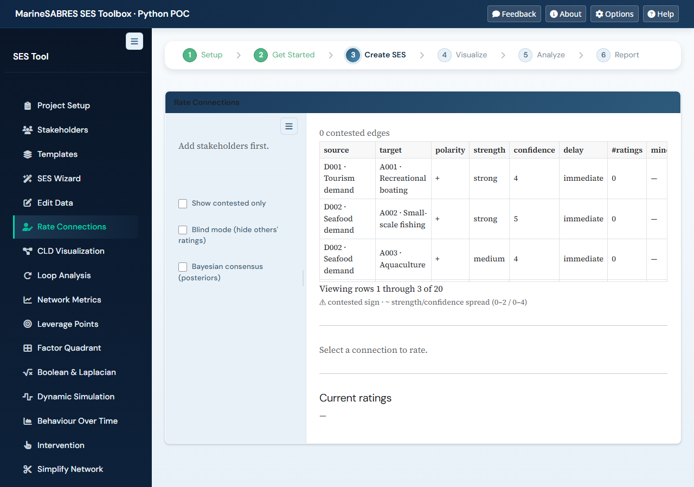
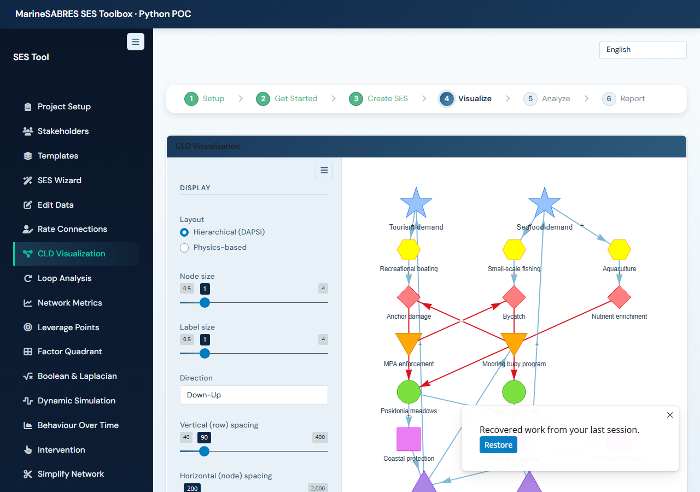
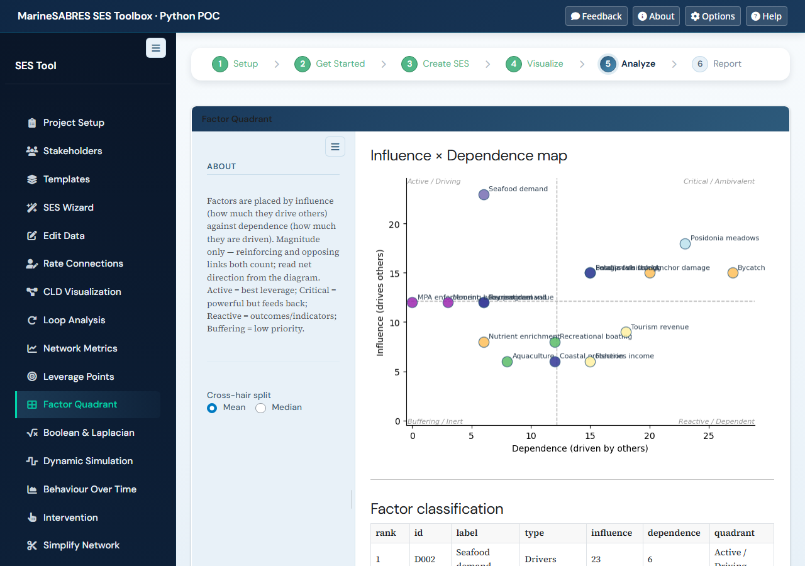
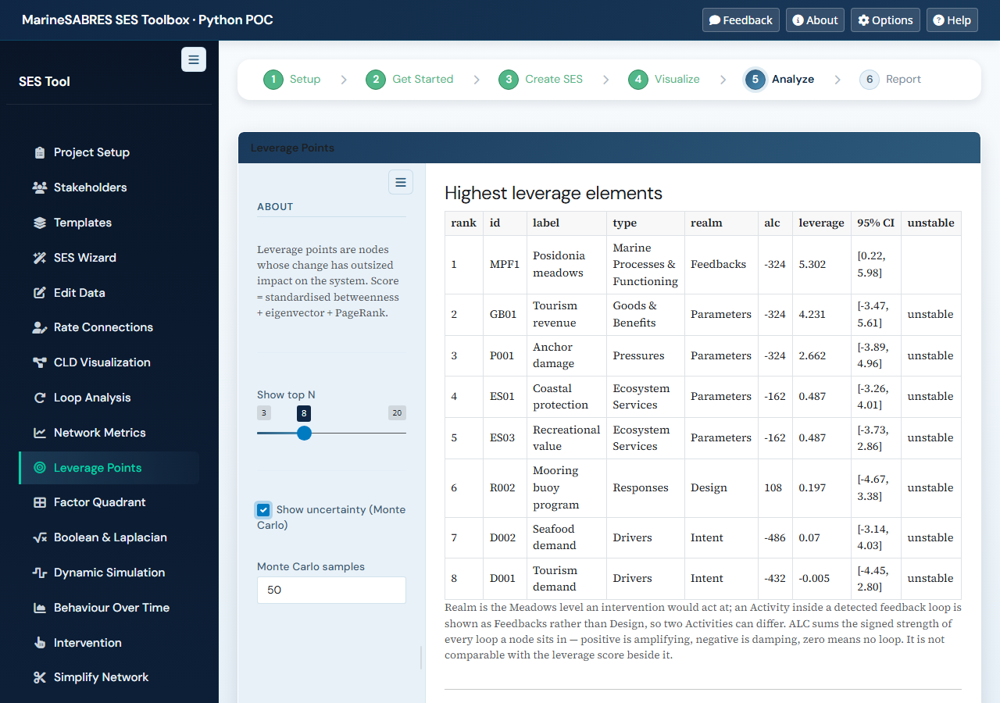
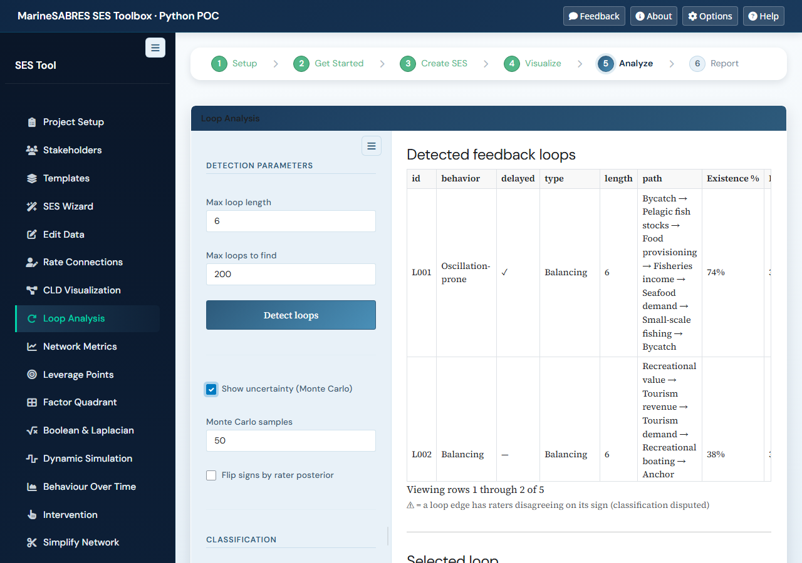
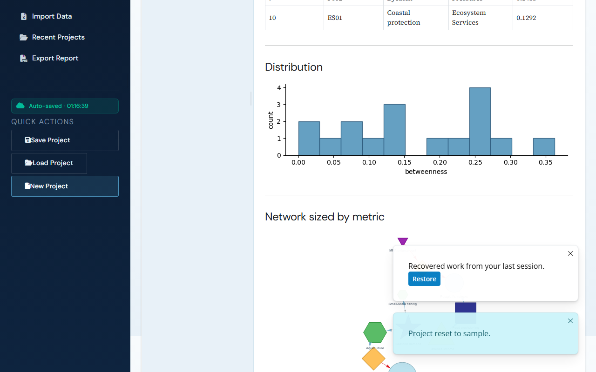
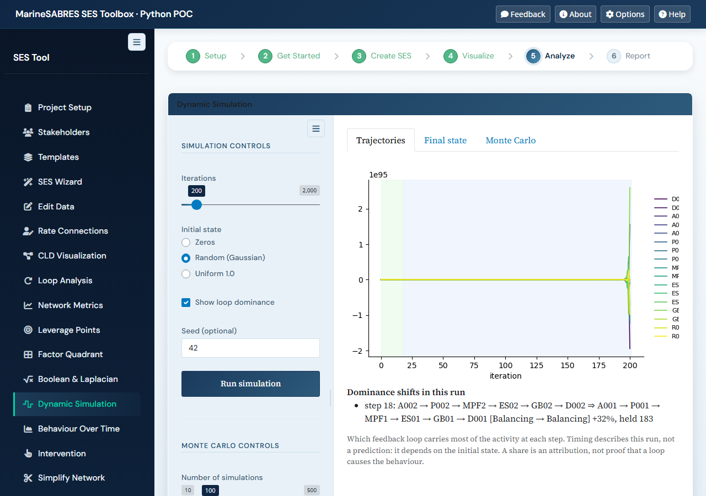
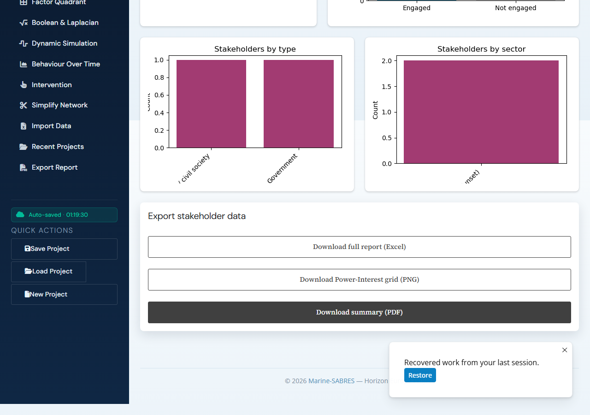
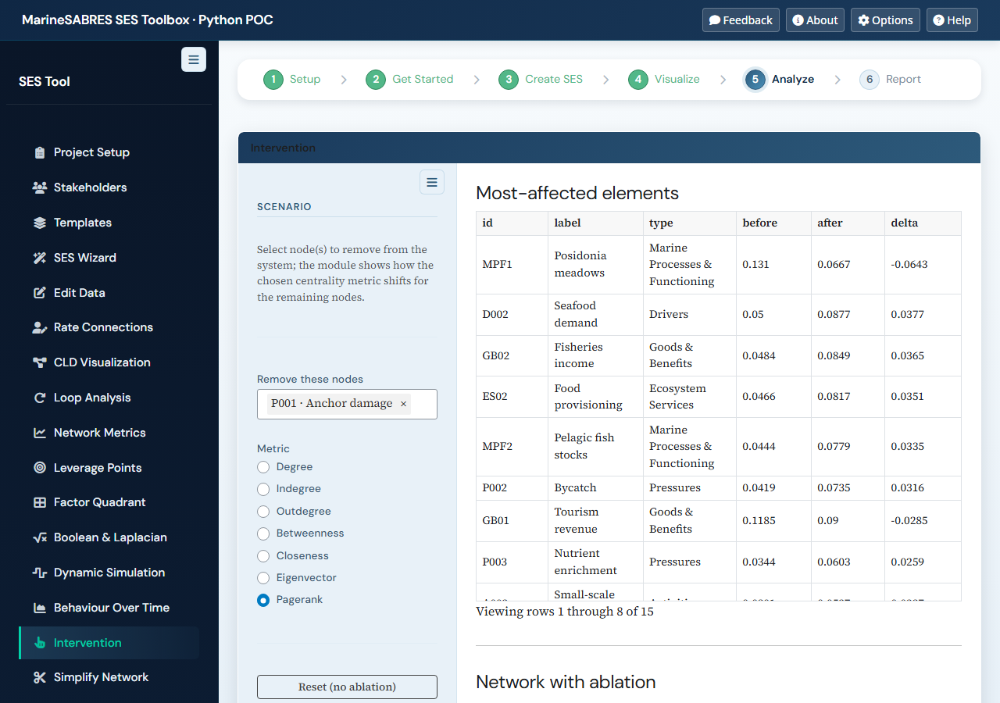
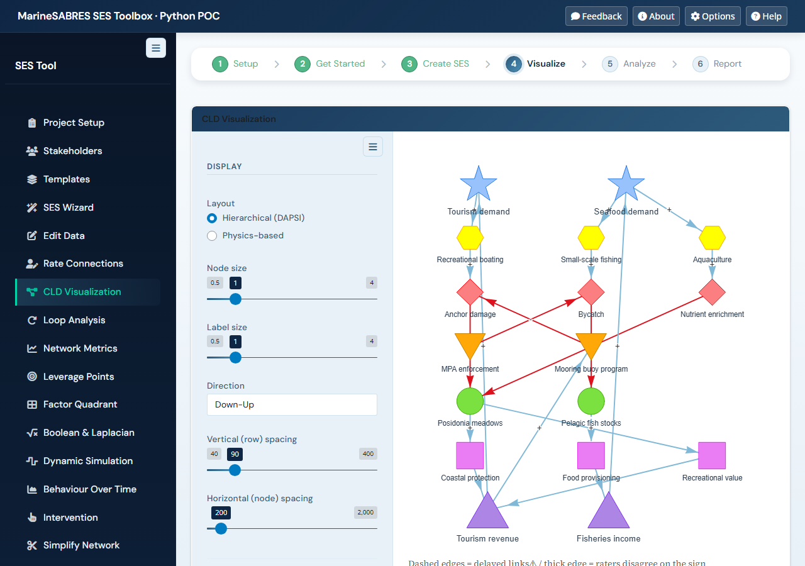

# SESPy — MarineSABRES SES Toolbox · Python port

[](https://github.com/razinkele/SESPy/actions/workflows/ci.yml)
[](LICENSE)


A Shiny-for-Python port of the [MarineSABRES SES Toolbox](https://marinesabres.eu)
that lives next door at `../SESToolbox/MarineSABRES_SES_Shiny`. The R app is
~90 KLOC across 46 modules with bs4Dash; this is the strategic-core port —
**19 modules** covering the create→edit→analyze→export workflow with
production-shaped infrastructure, now extended with multi-rater elicitation,
Monte-Carlo uncertainty, and FCM import (see [What's new in v1.0.0](#whats-new-in-v100)).

The R app is the **source of truth**: behaviour, schema, and intent come
from it. Where the port deliberately deviates (e.g. Responses on their
own row instead of vis.js's broken x-offset), commit messages call out
the why.

---

## Screenshots

Captured from v1.8.0 on the sample project by `tests/make_docs_screenshots.py`.
The full **user manual** (every panel, the science behind each analysis, and
the literature) is in [`docs/MANUAL.md`](docs/MANUAL.md) and in the app under
About → Manual.

| | |
|---|---|
| **Rate Connections** — multi-rater elicitation + contested-edges view | **CLD Visualization** — DAPSI-ordered hierarchical layout |
|  |  |
| **Factor Quadrant** — Vester influence × dependence | **Leverage Points** — composite score + Meadows realm + ALC |
|  |  |
| **Loop Analysis** — reinforcing / balancing / oscillation-prone | **Network Metrics** — fit, governance gap, actor influence, cascade, paths, subsystem modules |
|  |  |
| **Dynamic Simulation** — linear iteration + loop dominance + Monte Carlo | **Stakeholders** — PIMS register (Power × Interest) |
|  |  |
| **Intervention** — ablation + token diffusion | **Full app** — workflow stepper + nav |
|  |  |

---

## What's new in v1.8.1

Shiny for Python 1.7.0 migration: every `@render.download` renderer is now
`@render.download_button` (no user-visible change); floor pin raised to
`shiny>=1.7`. New guard test: a source scan fails the suite if
`render.download(...)` reappears anywhere, and a fresh-interpreter import
check fails on any module-level `ShinyDeprecationWarning` (a deprecation
that only fires inside a module's server function at session time is not
covered).

---

## What's new in v1.8.0

A **documentation** release:

- **User manual.** `docs/MANUAL.md`, also rendered in the app under
  About → Manual: all 19 panels, the science behind each analysis, and the
  literature that shaped v1.0 to v1.7 with verified DOIs.
- **About dialog** rebuilt (Overview · Manual · Changelog) with working
  screenshots; **screenshots** regenerated by `tests/make_docs_screenshots.py`.

---

## What's new in v1.7.0

One diagnostic, closing the last open literature issue (#25):

- **Cascade early warning.** The cascade table gains a KL column — the
  divergence of each step's surviving degree distribution from the previous
  step's — and a line naming the first step where that series departs from
  its running median, after Kraehling 2026. Both that step and the
  cascade-threshold step are printed, because on hub-shaped models the
  collapse comes first and the departure follows it.

---

## What's new in v1.6.2

Two corrections from the post-release review of #26: the governance
concentration verdict now follows the entropy as displayed (2 dp), and the
metrics e2e checks actor rank order on the table element itself.

---

## What's new in v1.6.1

One small diagnostic, from the 2026-09-01 literature alert (#26):

- **Governance concentration.** One sentence above the governance actor
  influence table says whether governance power is distributed across the
  actors or concentrated in one, with the dominant actor's share and the
  normalised entropy of the influence shares, after Heredia et al. 2026's
  polycentric-governance finding.

---

## What's new in v1.6.0

One feature, closing the last open literature issue (#24):

- **SES subsystem modules.** A button on the Network Metrics card detects
  hypermodules — groups of elements that community detection co-clusters
  across at least two of the three tier pairings (ecological / social /
  governance), after Pinheiro et al. 2026. Each is listed with its tier
  composition and member labels; every way a model can yield none gets its
  own translated explanation. Deterministic across runs, processes and model
  construction order — established empirically, not assumed.

Shipped via the brainstorm → spec → multi-agent adversarial review → TDD → review →
full-e2e cycle.

---

## What's new in v1.5.0

A **leverage-analysis depth** release, closing literature issue #23:

- **Loop-aware Meadows realm.** An Activity inside a detected feedback loop
  now classifies as Feedbacks rather than Design — a variable inside a loop
  acts at the feedback level. One classification, made structural, rather
  than the second, contradicting ladder the issue as filed would have added.
- **Adjusted Loop Centrality.** A signed per-node score beside the leverage
  composite: the sum of the structural gains of every detected loop the node
  sits in. Positive is amplifying structure, negative damping. Suppressed,
  with a note, on models past the loop-detection cap, where the sign is not
  reproducible between runs.
- **Quieter logs.** The eigenvector numpy fallback is routine on causal SES
  graphs (they are almost never strongly connected) and no longer warns on
  every model; the genuine all-zeros degradation still does.
- `environment.yml` now agrees with `pyproject.toml` on `networkx>=3.1`.

Shipped via the brainstorm → spec → multi-agent adversarial review → TDD → review →
full-e2e cycle.

---

## What's new in v1.4.0

A **network-analysis depth** release — nine literature-driven analyses added to the
Network Metrics, Intervention and Simulation panels — carrying one correctness fix
that changes shipped output:

- **Fix: Dynamic Simulation propagated influence backwards.** The ISA matrix stores
  `M[i,j]` as the edge i→j, but the iterator computes `x_{t+1} = M @ x_t`, so a
  node's next state depended on the nodes it points *at* rather than those pointing
  *into* it — on a two-node A→B graph seeded at A, nothing propagated at all.
  **Run Simulation and Monte Carlo results differ from previous versions**; anything
  published from those panels was computed with influence flowing the wrong way.
  The direction had never been tested: every prior test used identity or 1×1
  matrices, which are transpose-invariant.
- **Loop dominance over time (#22).** An opt-in overlay on the Simulation panel
  showing which feedback loop governs each phase of a run, with shifts named by
  their nodes, margin- and dwell-gated. Timing describes the run, not a prediction.
- **Governance analyses (#13, #14).** Directed coverage of pressure nodes by
  governance elements, and a centrality ranking restricted to governance actors that
  separates dominant from peripheral ones.
- **Cascade vulnerability (#15) and causal pathways (#16).** Sequential removal in
  leverage order tracking connectivity collapse and the cascade-threshold node; and
  a signed path tracer between any two elements with compound polarity and honest
  truncation.
- **Intervention simulation (#17, #19, #20, #21).** Seed tokens at an element and
  watch them diffuse along causal links — negative links flip a token's sign —
  giving a ranked reach, net sign and first-arrival step. It reports its own
  sampling error: a 95% margin per element, error bars on the chart, and ranks that
  statistically tied elements share, so a near-tie is never displayed as a firm
  ranking.
- **Fix: bounded loop enumeration (#18).** Feedback loops are now length-bounded
  during generation, so dense imported models can no longer hang Loop Analysis,
  uncertainty scoring or cascade vulnerability.
- **Per-session language.** The translator was a process-wide singleton, so one user
  switching language changed it for everyone on the server.

Shipped via the brainstorm → spec → multi-agent adversarial review → TDD → review →
full-e2e cycle.

---

## What's new in v1.3.0

A round of **usability + shell-consistency** work — surfacing feedback/help in the
app, making imported models render correctly, and giving the graph views a loading
cue:

- **Network graph loading spinner.** Every pyvis network view (CLD, Topology,
  Leverage, Network Metrics, Intervention, Loop Analysis, Simplify) shows a centered
  "Rendering network…" spinner while the graph builds and clears the instant it draws,
  so a slow render no longer looks like a blank panel.
- **Optional DAPSIWRM assignment on QSEM import.** An opt-in, heuristic-pre-filled
  per-theme mapping table so imported QSEM models render as a coloured, levelled CLD —
  and untyped / custom-themed elements are no longer silently dropped to an empty diagram.
- **Title-bar utility cluster.** Feedback, About, Options, and Help modals in the app
  title bar: a SQLite-backed feedback form (with a recent-feedback listing), an About
  view rendering this README + changelog, Options (theme, language, autosave), and a
  workflow Help summary.
- **Shared-shell CSS consolidation (internal).** The shell stylesheets ship as `sespy`
  package data via a single `HTMLDependency`, so apps embedding the shell (e.g. MosaicSES)
  get one always-current source instead of drifting local copies.

Shipped via the brainstorm → spec → multi-agent adversarial review → TDD → review →
full-e2e cycle.

---

## What's new in v1.2.0

A round of **multi-rater robustness + responsiveness** improvements — making
disagreement and uncertainty visible where the system is read, and keeping the UI
responsive under heavy analysis:

- **Disagreement-aware loops.** A feedback loop whose Reinforcing/Balancing
  classification *hinges on an edge the raters disagree on the sign of* now shows a
  `⚠` on its behavior label. (Scoped to loops by design: loop classification is
  sign-based, so polarity disagreement can threaten it — whereas leverage is structural
  and the quadrant is magnitude-based.)
- **Contested edges on the CLD.** Polarity-contested edges render with a heavier width
  + a `⚠` marker + a hover detail on the graph itself, not just the Rate Connections
  table.
- **Blind rating mode.** An opt-in toggle in Rate Connections hides peers' ratings until
  you submit your own (Delphi-style anti-anchoring); aggregate signals stay visible.
- **Responsive uncertainty.** The leverage/loop Monte-Carlo uncertainty now runs on a
  worker thread with a "computing…" indicator — toggling it no longer freezes the UI.

All four self-gate on multi-rater data, so single-author and imported models are
unaffected. Every one shipped via brainstorm → spec → multi-agent adversarial review →
TDD → review → full-e2e cycle.

---

## What's new in v1.1.0

- **Direct `.qsem` import.** Upload a native `.qsem` file (the QSEM web app's JSON
  node/link graph) straight into SESPy — nodes → elements, links → connections
  (`impact` → strength, `polarity` → sign, `delay` → lag), with ghost-node
  de-duplication and theme → DAPSI(W)R(M) type matching. The Import module
  auto-routes by file extension, so Excel workbooks and `.qsem` models share one
  upload.

---

## What's new in v1.0.0

Beyond the strategic-core port, v1.0.0 adds a sequence of analytic improvements
distilled from a QSEM (Hulme et al. 2026) and a weekly literature scan:

- **Multi-rater elicitation (QSEM-C).** A new **Rate Connections** module lets
  multiple stakeholders (from the PIMS register) each rate a connection; a
  *materialized-consensus* model derives the scalar `strength`/`confidence`/
  `polarity` every analysis reads, and a **contested-edges** view surfaces where
  the team disagrees.
- **Uncertainty-aware scoring (D2D).** `uncertainty_scores()` resamples edge
  confidence via an edge drop + sign-flip Monte Carlo, surfacing per-node leverage
  95% CIs and per-loop existence/polarity probabilities behind off-by-default
  toggles in the Leverage and Loop modules.
- **Social-ecological fit metric.** A graph-level social ↔ ecological coupling
  diagnostic in Network Metrics.
- **FCM import.** The Excel importer interprets a numeric (fuzzy-cognitive-map)
  weight cell as a signed weight — sign → polarity, magnitude → strength.
- **Factor Quadrant** (Vester influence × dependence, mean/median split) and
  **delay-aware Loop Analysis** (oscillation-prone loops).
- **Leverage typology** — each leverage row tagged with a Meadows depth realm
  (parameters / feedbacks / design / intent).

Every one of these shipped via a brainstorm → spec → multi-agent adversarial
review → TDD → review → full-e2e cycle. All 9 UI languages stay in sync.

---

## What's in this port

### Modules (19)

| Module | Source | Behaviour |
|---|---|---|
| **PIMS Project Setup** (`sespy/modules/pims_project.py`) | `modules/pims_module.R` (PROJECT SETUP) | Two-column form for project context: name, demonstration area, focal issue, definition statement, temporal/spatial scale, system in focus. Persists to project metadata via a parallel `project_metadata` reactive. |
| **PIMS Stakeholders** (`sespy/modules/pims_stakeholders.py`) | `modules/pims_module.R` (STAKEHOLDERS) | Stakeholder register — name, organisation, role, interest/influence — feeding the multi-rater panel in Rate Connections. |
| **Templates** (`sespy/modules/templates.py`) | `modules/template_ses_module.R` | Picker for built-in starter projects (Offshore Wind, Coastal Tourism, Small-scale Fisheries). |
| **SES Wizard** (`sespy/modules/ai_isa_wizard.py`) | `modules/ai_isa_assistant_module.R` (and `ai_isa/`) | 12-step DAPSI(W)R(M) wizard with confirmation modal, live writes per step, and a stub `suggest_connections()` ready for SP3/SP4 scoring backends. |
| **Edit Data** (`sespy/modules/isa_data_entry.py`) | `modules/isa_data_entry_module.R` | Add/remove elements & connections live; auto-IDs by DAPSIWRM type; cascading delete keeps the data validator-clean. |
| **Rate Connections** (`sespy/modules/rate_connections.py`) | *new (QSEM multi-rater)* | Stakeholders from the PIMS register each rate a connection; a materialized-consensus model derives the scalars every analysis reads, plus a contested-edges column/filter. |
| **CLD Visualization** (`sespy/modules/cld_visualization.py`) | `modules/cld_visualization_module.R` | Hierarchical/physics layouts with DAPSI-ordered rows, live size + spacing sliders, vis.js via `pyvis.shiny`. |
| **Loop Analysis** (`sespy/modules/analysis_loops.py`) | `modules/analysis_loops.R` | Feedback loop detection (max length / max loops sliders), classification (Reinforcing / Balancing — even-negatives rule from R), per-loop pyvis canvas. |
| **Network Metrics** (`sespy/modules/analysis_metrics.py`) | `modules/analysis_metrics.R` | Seven centrality measures (degree/in/out, betweenness, closeness, eigenvector, PageRank), top-N table, distribution histogram, pyvis network sized by metric. Plus four literature-driven blocks: governance gap (#13), governance actor influence (#14), cascade vulnerability (#15) and causal pathways (#16). |
| **Leverage Points** (`sespy/modules/analysis_leverage.py`) | `modules/analysis_leverage.R` | Composite leverage = z(betweenness) + z(eigenvector) + z(PageRank). Same formula R uses. |
| **Factor Quadrant** (`sespy/modules/analysis_quadrant.py`) | *new (QSEM parity)* | Vester influence×dependence scatter classifying every element as active, critical, reactive or buffering. |
| **Boolean / Laplacian** (`sespy/modules/analysis_boolean.py`) | `modules/analysis_boolean.R` | Laplacian eigenvalue spectrum + Boolean attractor enumeration via exhaustive 2^N state-space search (capped at 12 nodes). |
| **Dynamic Simulation** (`sespy/modules/analysis_simulation.py`) | `modules/analysis_simulation.R` | Deterministic linear-matrix iteration + Monte Carlo state-shift analysis with finite-aware divergence accounting, and an opt-in loop-dominance overlay shading each phase of a run by its governing feedback loop (#22). |
| **Behaviour Over Time** (`sespy/modules/analysis_bot.py`) | `modules/analysis_bot.R` | Per-element time-series view with three input modes (manual entry, CSV upload, ISA-derived synthetic), trend + moving-average overlays, summary statistics. |
| **Intervention** (`sespy/modules/analysis_intervention.py`) | `modules/analysis_intervention.R` | "Ablate node X" scenarios — pick nodes to remove, see before/after centrality shifts, network with greyed-out ablated nodes. |
| **Simplify Network** (`sespy/modules/analysis_simplify.py`) | `modules/analysis_simplify.R` | Network reduction by minimum strength OR top-N edges by composite weight. Optional drop-isolated. |
| **Import Data** (`sespy/modules/import_data.py`) | `modules/import_data_module.R` | Excel upload (Elements + Connections sheets, case-insensitive column-name fallbacks) **or native `.qsem`** model files (auto-routed by extension), schema-validated preview, commit-to-project. |
| **Recent Projects** (`sespy/modules/recent_projects.py`) | `modules/recent_projects_module.R` | List of recently saved/loaded files with click-to-load and remove. Persisted across sessions in `~/.sespy/recent.json`. |
| **Export Report** (`sespy/modules/report_export.py`) | `modules/prepare_report_module.R` + `export_reports_module.R` | HTML / PDF (WeasyPrint) / Word (python-docx) — same content, three formats. Live preview iframe. |

### Optional Claude API backend (SP4)

In addition to the SP3 rule-based scorer that runs on every wizard
session, SESPy ships an optional Claude API backend for the
connection-suggestion step. When `ANTHROPIC_API_KEY` is set in the
environment, a [Generate with Claude API] button appears on step 11
of the wizard. Clicking it opens a one-time per-session consent
modal listing the data sent (regional sea, ecosystem type,
countries, main issues, all element labels and IDs); on confirm,
the backend calls Claude Sonnet 4.6 with structured tool-use output
and renders results in a second table below the rule-based
suggestions. SP3 results stay visible — the two backends are
side-by-side, and the user accepts from either or both at Finish.

**Getting an API key:** create an Anthropic account at
https://console.anthropic.com/, generate a key under Settings →
API Keys, and set it in your shell before launching SESPy:

```bash
# POSIX:
export ANTHROPIC_API_KEY=sk-ant-...

# Windows PowerShell:
$env:ANTHROPIC_API_KEY = "sk-ant-..."
```

**Cost:** ~$0.02–$0.05 per click (Sonnet 4.6 input pricing). A
typical wizard session is 10–30 clicks → $0.20–$1.50 per session.
SESPy does NOT enforce a per-session spending cap; set spending
alerts in the Anthropic console (Settings → Plans & Billing →
Usage Limits) for cost protection. Override the default model with
`SESPY_CLAUDE_MODEL=<model-id>`. For institutional deployments
where Claude must be globally disabled even when a key is present,
set `SESPY_DISABLE_CLAUDE=1`.

**Privacy:** Anthropic processes API requests per their privacy
policy at https://www.anthropic.com/legal/privacy (default 30-day
retention); zero-retention requires a separate agreement with
Anthropic. Each user provides their own key — SESPy does not store
keys. Users handling politically-sensitive jurisdictions (sanctioned
regions, named individuals in element labels, embargoed research)
should consult their institutional data-governance policy before
enabling the Claude backend.

### Shell + infrastructure

| | What |
|---|---|
| `sespy/dashboard.py` | bs4Dash-style shell (page_sidebar): brand block, action-button nav, **clickable** workflow stepper, language switcher, quick actions slot, footer. Hamburger toggle (hijacks bslib's outer `.collapse-toggle`) collapses the nav to icon-only mini-mode. |
| `sespy/i18n.py` + `sespy/translations/core.json` | R-compatible translation system (same JSON shape as `shiny.i18n`). Live language switching for nav and stepper (`@render.ui`); module-body labels capture the language at construction (page-reload story for those). 9 languages: en/es/fr/de/lt/pt/it/no/el. **Module-level `t()` singleton** — `from sespy.i18n import t` and use it directly. |
| `sespy/modules/project_io.py` + `sespy/persistent_storage.py` | Save (download JSON via `@render.download`), Load (file upload + validation), New Project (reset to sample). Atomic writes (`tempfile.mkstemp` + `os.replace`). Validation catches missing fields, dangling references, duplicate ids. |
| `sespy/autosave.py` | Writes `~/.sespy/autosave.json` on every `event_bus.isa_change`. Sidebar shows "Auto-saved · HH:MM:SS" indicator. On session start, sticky toast offers to restore the last autosave (skipped if older than 24h). Manual Save clears the autosave. |
| `sespy/recent_projects.py` | Persisted recent-files registry at `~/.sespy/recent.json`. Capped at 10 entries, dedupes on path, auto-filters missing files. |
| `sespy/event_bus.py` | Counter-trigger reactives — port of `functions/event_bus_setup.R`. `emit_isa_change` propagates to **six** listeners (CLD, Loops, Metrics, Leverage, Intervention, Simplify) without re-entrancy. |
| `sespy/data_structure.py` | `Element`, `Connection`, `IsaData`, `Project`, `ProjectMetadata` — minimal port of `functions/data_structure.R`. |
| `sespy/network.py` | `to_digraph`, `feedback_loops`, `loop_polarity`, `classify_loops`, `centrality_metrics`, `top_n_by_metric`, `leverage_scores`, `intervention_impact`, `remove_nodes`, `simplify_by_strength`, `simplify_top_n_edges` — networkx-based port of `functions/network_analysis.R` helpers. |
| `sespy/excel_import.py` | Pandas/openpyxl-based parser with column-name fallbacks (`from`/`source`, `to`/`target`, `Name`/`Label`, etc.). Reuses the JSON validator so error stories are consistent. |
| `sespy/report.py` | Jinja2 template + WeasyPrint (PDF) + python-docx (Word). Three export formats from one content model. |
| `sespy/templates/` | Built-in starter projects: Offshore Wind, Coastal Tourism, Small-scale Fisheries. `list_templates()` discovers `*.json` files. |
| `sespy/constants.py` | DAPSI element types, Kumu-style colors and shapes, hierarchical level numbers, font/size scales, edge colors, polarity labels. |
| `www/sespy-skin.css` | Visual port of `bs4dash-custom.css` "Deep Ocean Scientific" theme. Tokens (`--ocean-*`, `--bio-*`, `--foam-*`, `--mist-*`) lifted verbatim; selectors re-authored for bslib's DOM. Fonts: DM Sans + Source Serif 4. |

### Install it

Two paths, depending on what you need:

**Full app — conda / micromamba (recommended).** The CLD/graph view renders
through `pyvis.shiny`, which lives in a fork of pyvis (v4.x) published on the
Anaconda channel [`razinka`](https://anaconda.org/razinka/pyvis) — conda-forge's
`pyvis` tops out at 0.3.x and has no `.shiny`. Install pyvis from that channel,
then the remaining dependencies into the same environment:

```bash
micromamba install -c razinka -c conda-forge pyvis   # pulls pyvis 4.x (with .shiny)
# + the deps declared in pyproject.toml (shiny, networkx, scipy, pandas,
#   numpy, matplotlib, jinja2, openpyxl, python-docx, anthropic; weasyprint for PDF)
```

**Library / programmatic use — pip.** The pure-Python layer (data model,
network + dynamics analysis, connection scoring, HTML report) installs cleanly
from source or the wheel:

```bash
pip install .            # core dependencies
pip install ".[pdf]"     # + WeasyPrint for PDF export (needs native cairo/pango)
```

⚠️ A plain `pip install` pulls upstream pyvis from PyPI (0.3.x, no `.shiny`), so
`import app` and the graph-rendering modules need the `razinka`-channel pyvis
shown above — use the conda/micromamba path for the full app. (pip still gives
the full pure-Python library layer.)

### Run it

```bash
micromamba activate shiny
cd "C:/Users/arturas.baziukas/OneDrive - ku.lt/HORIZON_EUROPE/Marine-SABRES/SESPy"
shiny run --port 8000 app.py
# Open http://127.0.0.1:8000
```

### Test it

```bash
# Unit tests (exclude the standalone browser scripts, which need a live server)
micromamba run -n shiny pytest tests/ -q \
  --ignore-glob='*e2e*' --ignore=tests/test_burger.py \
  --ignore=tests/test_stepper.py --ignore=tests/test_stepper_click.py

# Full Playwright e2e — one command boots the server, runs all 31 browser
# scripts, and handles the wizard's ANTHROPIC_API_KEY two-pass:
micromamba run -n shiny python tests/run_e2e.py
```

Refresh the manual's screenshots for a release (needs a server on port 8000;
writes `docs/screenshots/*.png`, not part of the e2e gate):

```bash
micromamba run -n shiny python tests/make_docs_screenshots.py --port 8000
```

668 unit tests + 31 standalone Playwright scripts (32 runs — the wizard
runs twice, once without an API key and once with a fake one). `tests/run_e2e.py`
orchestrates the e2e suite (server lifecycle + the wizard no-key/fake-key
passes); the individual `tests/test_*_e2e.py` scripts can also be run directly
against a server already on `localhost:8000`. Both layers run in CI on every
push (see `.github/workflows/ci.yml`): pip unit tests on Python 3.11/3.12, a
conda full-app job (import + boot smoke), and the full e2e suite.

---

## Architectural decisions

A handful of choices that aren't obvious from reading the code.

**Module signature contract.** Every module follows the R convention from
CLAUDE.md: `module_ui(id)` and `module_server(id, *, project_data,
event_bus, translator=None)`. This is what makes "wire one more module"
trivial — it's always the same call shape.

**`Project` envelope, not flat `{elements, connections}`.** Saved files
are `{metadata: {…}, isa_data: {elements: […], connections: […]}}`. The
loader tolerates the older flat shape (used by the seed `data/sample_ses.json`)
but new saves always use the envelope. Future work adds project history,
settings, etc. into the metadata block.

**`reactive.value` plain attribute split (in `Translator`).** Shiny for
Python's reactive.value doesn't update synchronously outside an active
flush context, which broke unit tests. The Translator keeps a plain `_lang`
attribute as the synchronous source of truth, with `language` as a
notification channel for reactive subscribers. Same pattern is reusable
for any state that needs to work both in tests and in live sessions.

**vis.js rendering via `pyvis.shiny`, not iframes.** The user maintains
[a fork of pyvis](https://github.com/razinkele/pyvis) with a
`pyvis.shiny.render_pyvis_network` decorator. We use it instead of
emitting standalone HTML in iframes. Two payoffs: no duplicate
vis-network bundle on the page (one per panel would mean four), and
proper Shiny event integration (clicks, hover, selections all flow back
into reactive inputs).

**DAPSI levels are small adjacent integers (0–6).** vis.js treats level
*numbers* as multipliers for `levelSeparation`. We tried 0/10/20/.../50
to leave room for inserting Responses at level 25 — ended up with a
4500 px tall canvas in a 650 px viewport. Use small adjacent integers
and let `levelSeparation` (pixels) do its job.

**Hamburger replaces both `<` chevrons.** bslib renders sidebar
`.collapse-toggle` buttons with an SVG chevron. We hide the SVG with
`visibility: hidden`, then paint a Font Awesome `fa-bars` glyph via
`::before` on the same button. Survives bslib version upgrades because
we don't depend on internal HTML.

**The outer hamburger is hijacked, not added separately.** Capture-phase
JS handler reads bslib's outer toggle clicks, calls
`stopImmediatePropagation`, and toggles `body.sespy-sidebar-mini`. The
mini class then overrides the grid template (`grid-template-columns:
64px minmax(0,1fr)`) so the main column expands. bslib's resize
observer inlines literal pixel widths into the grid template, so CSS
variable changes alone don't reflow — `!important` direct overrides
are necessary.

**Card containing a vis-network must not have `transform`.** vis.js's
tooltip positioning depends on no ancestor having a CSS `transform`.
The `.sespy-card-canvas` class (applied to canvas-hosting cards) sets
`transform: none !important`, including overriding the default card
hover lift. Same constraint is documented in the R `bs4dash-custom.css:452`.

---

## Testing

**258 unit tests** across:

- `tests/test_network.py` — graph metrics (centralities, leverage, loops, polarity, top-N, intervention impact, simplification)
- `tests/test_persistent_storage.py` — save/load roundtrip, atomic writes, validation
- `tests/test_i18n.py` — loader, lookup, fallback, switch, format interpolation
- `tests/test_excel_import.py` — workbook parsing with column-name fallbacks
- `tests/test_report.py` — HTML structure, PDF round-trip, Word docx round-trip
- `tests/test_autosave.py` — write/read/clear/age, corrupt-file safety
- `tests/test_recent_projects.py` — registry add/remove/dedupe, missing-file filtering, MAX_RECENT cap
- `tests/test_templates.py` — every template loads and validates, distinct names, populated metadata
- `tests/test_data_structure.py` — schema versioning, PIMS metadata round-trip, `WizardState` / `ConnectionSuggestion`
- `tests/test_utils.py` — shared helpers (`next_id` gap-filling)
- `tests/test_wizard.py` — wizard step flow, element-type map, regional-seas placeholder, stub

**22 end-to-end test scripts** (`tests/test_*_e2e.py` plus the burger/stepper
sidebar scripts: shell, data-entry, i18n, quick-actions, metrics, intervention,
leverage, import, templates, autosave, report, boolean, boolean-happy,
simulation, bot, pims-project, wizard, full-app, burger, stepper). Each starts
headless Chromium and asserts on the live app's DOM and reactive state. Run the
whole suite with `python tests/run_e2e.py` (it manages the server and the
wizard's two ANTHROPIC_API_KEY passes), or run a single script against a server
already on `localhost:8000`. Because the nav/stepper are reactive `@render.ui`
outputs, e2e scripts `wait_for_selector`/`wait_for_function` on the target
element before querying — never a fixed sleep (which races the first render).

The diagnostic scripts (`tests/diagnose_browser.py`, `tests/probe_*.py`,
`tests/inspect_frames.py`) are not pytest tests — they're throwaway tools
for investigating layout / state issues during development.

---

## What's deferred (and where it would slot in)

| Feature | Slot | Notes |
|---|---|---|
| `analysis_bot` (Behaviour Over Time charts) | New `sespy/modules/analysis_bot.py` | Simulate node values over `t` steps; matplotlib output. ~3 hours. |
| `analysis_boolean` (Boolean network logic) | New module | DTU dynamics package in R. Mid-effort port. |
| `analysis_simulation` (PCA phase-space dynamics) | New module | Heavier — needs scipy or simple ODE; uses centrality results. |
| PIMS suite (5 stakeholder/risk modules) | New module set | Different domain track; could ship as a "PIMS pack" later. |
| AI-assisted SES creation | New module | Calls Claude API. Different scope than data-pipeline modules. |
| Graphical SES creator (drag-drop) | New module | Largest single R module (~1500 LOC). |
| Per-element-type ISA forms | Extend `isa_data_entry.py` | Activities have `scale`, ES have `indicator`, Pressures have `type` — type-specific fields. |
| Header right-aligned actions (Settings / Help / About) | `dashboard_page(header_actions=…)` | Slot exists; only language switcher inside today. |
| Expandable nav submenus (PIMS, SES Creation grouped) | `NavItem` grows to tree shape | Mirrors bs4Dash's `bs4SidebarMenuSubItem`. |
| URL bookmarking (`?lang=es&tab=loops`) | Shiny for Python's bookmarking API | ~half a day. |
| Static-label i18n in modules | Wrap remaining `ui.h4(...)` etc. in `@render.ui` | We did the high-value labels (card headers, sidebar headers, button text); ~30% of in-module text still falls back to English on language change. Mechanical retrofit. |
| Tutorial system (overlay help) | New module | R has `tutorial_system.R` (~500 LOC). Nice-to-have. |
| Multi-user session isolation | Infrastructure | R has it for shiny-server deployments. Production concern. |

---

## How a new module gets ported

1. **Pick the R source** under `../SESToolbox/MarineSABRES_SES_Shiny/modules/`. Read its UI section (what controls, what outputs) and server section (what reactives, what event-bus listeners).
2. **Create `sespy/modules/<name>.py`** with `@module.ui` and `@module.server`. Match the R signature: `(id, *, project_data, event_bus, translator=None)`.
3. **If new graph algorithms are needed**, add them to `sespy/network.py`. Pure functions taking `IsaData`, returning dicts/lists. Add unit tests with golden values for tiny inputs.
4. **If new translation keys are needed**, add to `sespy/translations/core.json`. All 9 languages required.
5. **Wire into `app.py`**: `NavItem`, `nav_panel`, server call, optional `NAV_TO_STEP` mapping.
6. **Add unit tests + an e2e test.** Pattern from existing tests works: `await page.click('#__sespy_nav__<id>')`, then assert on the pyvis canvas state via `window.pyvisNetworks['<ns>-<output_id>']`.
7. **Run all tests + restart the server + take a screenshot** to confirm visual parity with the R counterpart.

The repeating pattern across all five existing modules makes module #6 mostly mechanical — about 4–6 hours of work depending on graph-algorithm complexity.

---

## Acknowledgements

R source authored by the MarineSABRES Consortium (Horizon Europe Project).
Python port by the project maintainer, developed with iterative review against the R app.
